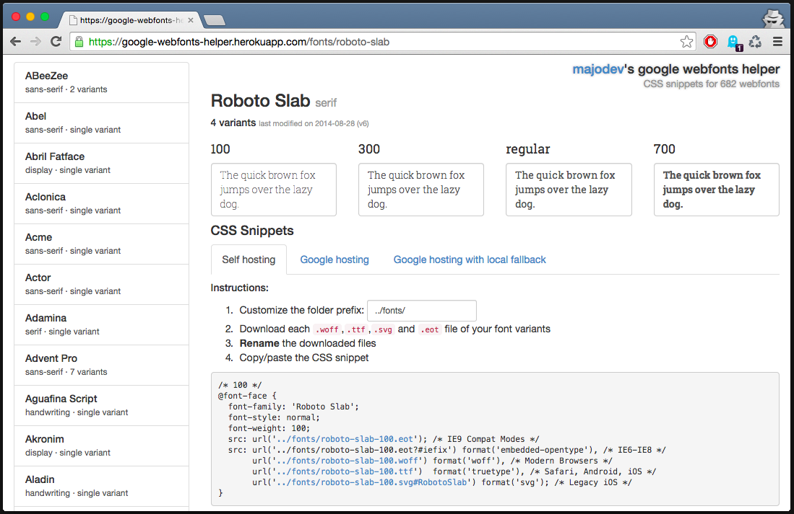

Let's get this straight: The effort to host Google web fonts on your own server is immense! First of all you need to download all `.eot`, `.woff`, `.ttf` and `.svg` files, then copy them onto your server and finally paste a CSS snippet. Sounds easy? Well it *could* be, if Google *would actually provide* any download links and a CSS customizer to fit your requirements. To fix this problem without using font generation services like Font Squirrel, I decided to publish a little service called [google-webfonts-helper](https://google-webfonts-helper.herokuapp.com/fonts).

The service uses Google's font API to retrieve a list of all available web fonts and fetches links to the `.eot`, `.woff`, `.ttf` and `.svg` files by parsing their hosted CSS files (and faking the `User-Agent` to get them). Hence, there is neither a need to directly host any fonts on my service, nor do I need a database (a simple `memcache` is sufficient). Here's how this looks like currently:

Internally, I'm using the (M)EAN stack (without MongoDB) as I really needed some practice with [Angular](https://angularjs.org/) and [Express](http://expressjs.com/). Restful services are great and I can recommend anyone starting up a small project like this to take a look at the [yeoman angular-fullstack](https://github.com/DaftMonk/generator-angular-fullstack) generator. Without prior knowledge, I came up with a working prototype in less than 5 hours! Freaking productive work flow.

As always please leave comments if you have any suggestions and take a look at the code on [GitHub](https://github.com/majodev/google-webfonts-helper).