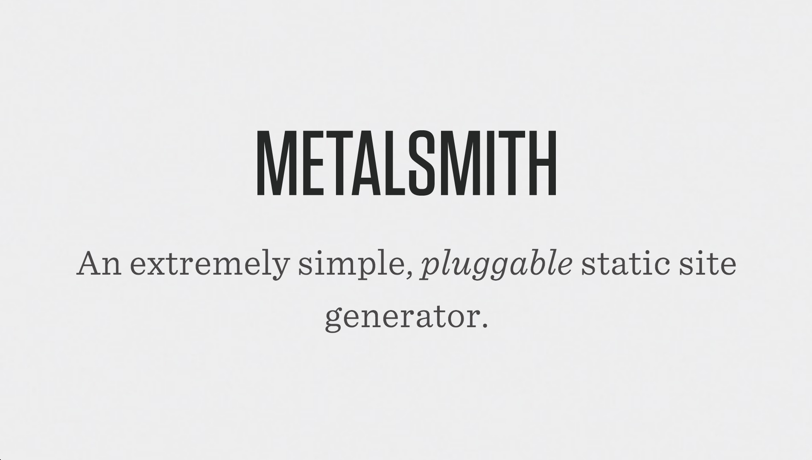

Early in the process of developing this website with **[metalsmith][metalsmith]** - *a static site generator* - I came to the conclusion, that some functionalities, that I really needed, cannot be fulfilled by any publicly available metalsmith plugin ([and there are many](http://www.metalsmith.io/#the-plugins)). Luckily, it's dead fucking easy to customize the metalsmith pipeline. Actually, it's that freaking easy, I finally ended up with XXX (*yes, xxxx*) custom written plugins, which I want to share with you here!



This post will give you an overview and some background information on how I was using my custom written plugins to build this site. Furthermore, I have also published every one of them on GitHub, so feel free to [check them out there][pluginrepo] if you want to code right away!

## metalsmith-collectiondefaults
Love [metalsmith-collections](https://github.com/segmentio/metalsmith-collections)? Fine, me too! However, does every collection child really need the same metadata key (e.g. `template: note.hbs`) in its [YAML][YAML] frontmatter? That's crazy (and ugly)! How about adding default metadata to your collection children? Sold? Enjoy.

```javascript
// Example usage of metalsmith-collectiondefaults
Metalsmith(__dirname)
// [...]
  .use(collections({ // metalsmith-collections must be executed first
    notes: { // let's define our notes collection
      pattern: "notes/**/*.md"
    }
  }))
  .use(collectiondefaults({ // then, execute metalsmith-collectiondefaults 
    notes: { // let's give every note the same template in its metadata
      template: "note.hbs"
    }
  }))
// [...]
```

## metalsmith-filetimestamp
I only want to add a `date` field to my [YAML][YAML], if I need to trick the reader (*yes, you!*) into thinking that page was published later than I originally created it. Hence, why not read the `createdAt` date from the file system, additionally, outputting the `lastModified` date of a page would also be a nice thing to have.

This plugin appends both of these keys to your metalsmith files' metadata.

``` javascript
Metalsmith(__dirname)
// [...]
  .use(filetimestamp())
// [...]
```

## metalsmith-firstparagraph

## metalsmith-hbs

## metalsmith-headingsidentifier

## metalsmith-highlightjs

## metalsmith-permapath

## metalsmith-tagtree

## metalsmith-wordcount

[YAML]: http://www.yaml.org/ "Official YAML website"
[metalsmith]: http://metalsmith.io "Official metalsmith website"
[pluginrepo]: https://github.com/majodev "majodev github repo"