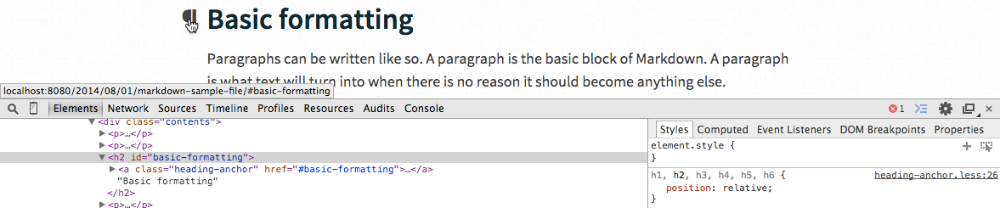

[As promised][helloworld], lets break out my customized plugins I've used with [metalsmith][metalsmith] to build up this site. ~~This note will be a updated until I think the job is done.~~ OK, I'm done for now, my other plugins already exist in a less specialized or better way (UPDATE 3).

I've published these plugins:
- [metalsmith-wordcount](#metalsmith-wordcount)
- [metalsmith-headingsidentifier](#metalsmith-headingsidentifier) (UPDATE 1)
- [metalsmith-datamarkdown](#metalsmith-datamarkdown) (UPDATE 2)

### How to extract logic into standalone packages

Before publishing, my custom metalsmith plugins lived in their respective `metalsmith-XXX.js` file within the same project directory. I simply required them in my `index.js` file. Now I'm moving them into their own package, so they can be reused in the future. Here's a quick overview on how to do that:
1. The first step was to set up a new package for each plugin.
2. `npm init` to get a proper one and install all dependent packages that you will need in the plugin.
3. Copy over all the code and point the `main` field in your `package.json` to the proper file. Attention, don't forget do install all required dependencies!
4. `npm link` your new package to temporary [locally use it within your root project][localpkg].
5. Test and [finally publish it][pubnpm].

### metalsmith-wordcount
Are you curious about how the word count and estimated reading time are computed on my site? It's done via my plugin [metalsmith-wordcount][metalsmith-wordcount-github]. It calculates the wordcount and average reading time of all paragraphs in a HTML file.

[install from npm][metalsmith-wordcount-npm] · [source on github][metalsmith-wordcount-github]

### metalsmith-headingsidentifier
Do you want to automatically turn your markdown headings (`h1-h6`) into clickable permalinks? Then grab [metalsmith-headingsidentifier][metalsmith-headingsidentifier-github]. This idea is originally by [Remy Sharp](http://remysharp.com/2014/08/08/automatic-permalinks-for-blog-posts), with the difference, that it's now done during generation time with [metalsmith][metalsmith].

[install from npm][metalsmith-headingsidentifier-npm] · [source on github][metalsmith-headingsidentifier-github]

### metalsmith-datamarkdown

[Inspired by Paul Irish's work](https://gist.github.com/paulirish/1343518) to use markdown within HTML tags, here comes *"something similar" (not as sophisticated)* wrapped in a metalsmith plugin. Now you can use `data-markdown` attributes to identify tags, that wrap markdown content and need to be converted to HTML during generation time.

[install from npm][metalsmith-datamarkdown-npm] · [source on github][metalsmith-datamarkdown-github]

### Further reading

- [Taking Baby Steps with Node.js – Linking Local Packages with npm][localpkg]
- [Getting Started with NPM (as a developer)][pubnpm]
- [How to write metalsmith plugins][metalsplughow]

<!-- libs -->

[metalsmith-wordcount-npm]: https://www.npmjs.org/package/metalsmith-wordcount "metalsmith-wordcount on npm"
[metalsmith-wordcount-github]: https://github.com/majodev/metalsmith-wordcount "metalsmith-wordcount on github"

[metalsmith-headingsidentifier-npm]: https://www.npmjs.org/package/metalsmith-headingsidentifier "metalsmith-headingsidentifier on npm"
[metalsmith-headingsidentifier-github]: https://github.com/majodev/metalsmith-headingsidentifier "metalsmith-headingsidentifier on github"

[metalsmith-datamarkdown-npm]: https://www.npmjs.org/package/metalsmith-datamarkdown "metalsmith-datamarkdown on npm"
[metalsmith-datamarkdown-github]: https://github.com/majodev/metalsmith-datamarkdown "metalsmith-datamarkdown on github"

<!-- internal links -->

[helloworld]: /2014/09/30/hello-world/ "Hello World"

<!-- external links -->

[metalsmith]: http://metalsmith.io "Official metalsmith website"

[localpkg]: http://elegantcode.com/2011/12/16/taking-baby-steps-with-node-js-linking-local-packages-with-npm/ "Taking Baby Steps with Node.js – Linking Local Packages with npm"

[pubnpm]: https://gist.github.com/coolaj86/1318304 "Getting Started with NPM (as a developer)"

[metalsplughow]: https://gist.github.com/unstoppablecarl/d864d662c3f1a1688a91 "How to write metalsmith plugins"
